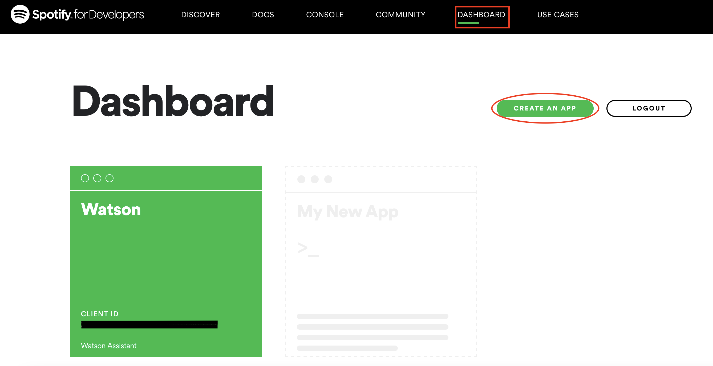
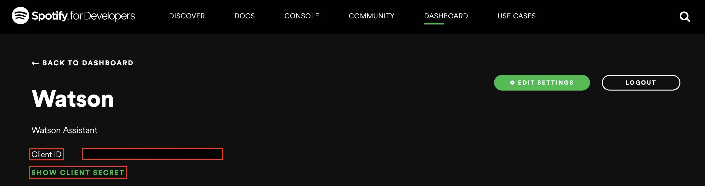
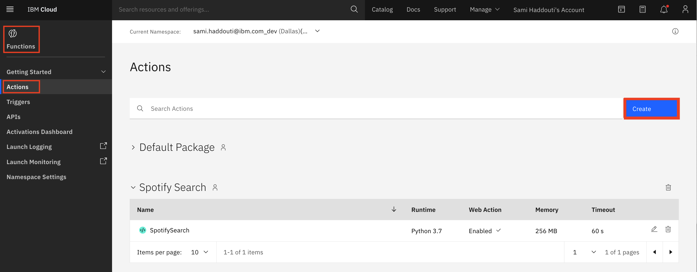
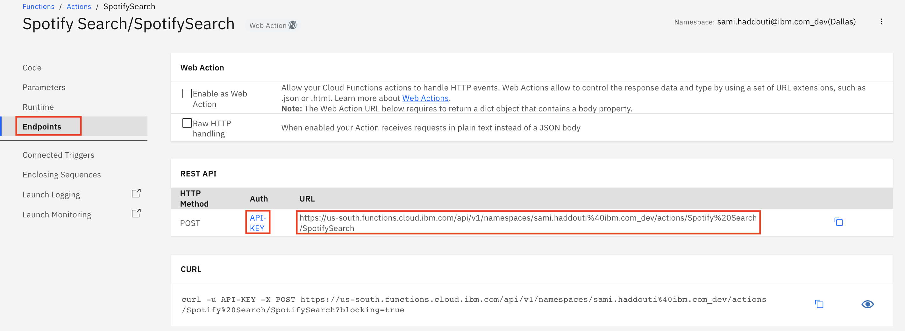
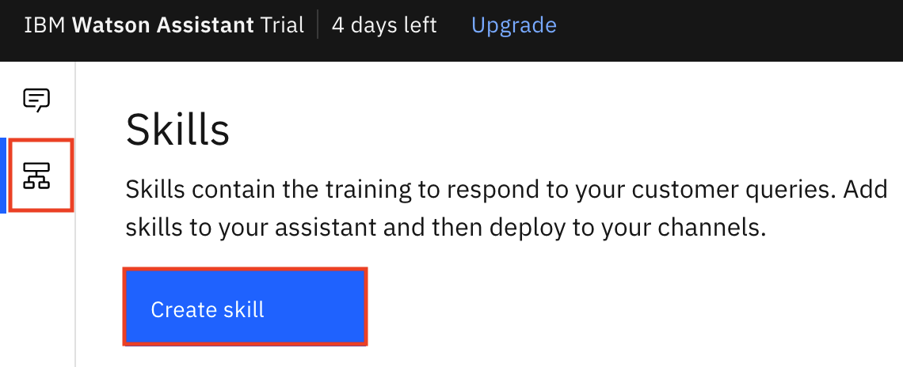
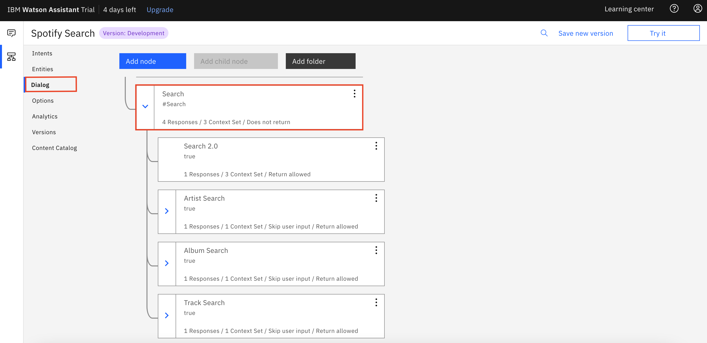
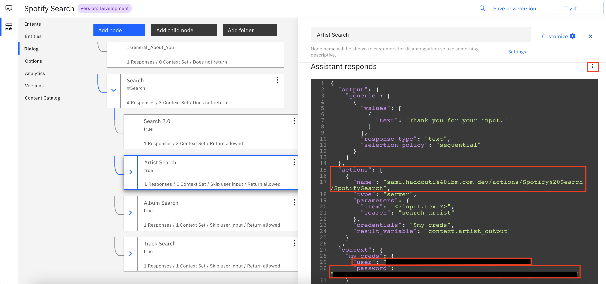

<h1 align="center" style="border-bottom: none;">🤖 IBM Watson Assistant Spotify  Tutorial 🤖</h1>
<h3 align="center">In this tutorial you will learn how to link the IBM Cloud Watson Assistant to the Spotify API using Python and the IBM Cloud Functions to search for songs, albums and artists. </h3>


## Prerequisites

1. Sign up for an [IBM Cloud account](https://cloud.ibm.com/registration).
2. Fill in the required information and press the „Create Account“ button.
3. After you submit your registration, you will receive an e-mail from the IBM Cloud team with details about your account. In this e-mail, you will need to click the link provided to confirm your registration.
4. Now you should be able to login to your new IBM Cloud account ;-)
5. Also sign up for an [Spotify Developer account](https://developer.spotify.com/dashboard/login).
6. Lastly install [Python](https://www.python.org/downloads/).

## Setting up Spotify API

<h4>1) Create an Spotify App</h4>
After the login you will see your Spotify Developer Dashboard. There you will have to create an app. Give it a name, click on Create and it should look similar to the screenshot.

&nbsp;



<h4>2) Get credentials</h4>
Now navigate to the app and you should find the Client ID and below that the Client Secret (click on "Show Client Secret" to view it). Save the two somewhere safe because we will need them soon in our Python Code.  


&nbsp;



##  Building our Cloud Function 

<h4>1) Create a Cloud Function </h4>
Go to the IBM Cloud website, log in and search for Cloud Functions. You could also look for Functions in the IBM Cloud catalog. 
Now navigate to Actions and create a new Action. The name and package is up to you, but don't forget to set the Runtime to Python.

&nbsp;



Copy and Paste the Python Code from the SpotifySearch.py file in your action. Most of the code is explained with comments but if you find something odd or encounter problems don't bother to ask.

In your action dashboard go to Endpoints and write down the REST API URL and the API KEY which consists of a username (everthing in front of the colon = :) and a password (the rest after the colon). We will need the URL and authentication for later to link our function to the assistant.



Now lastly we will check if our code works. For that go back to your code and click on Invoke with parameters. Copy and paste the lines below or feel free to search for something else (just define the search and item parameters with adequate values). 

```
{
    "search":"search_album",
    "item": "Graduation"
}
```
Then click on Invoke and you should get an url as result and a green check mark.
If not, check the logs to find the error. 

## Building the Watson Assistant

Now go back to the IBM Cloud Website and search for the Watson Assistant. There you can create a new instance. Launch it and navigate to the Skills. Click on Create Skill, select the Dialog Skill and then Upload Skill. Download the skill-Spotify-Search file from this repository  and upload it to the assistant. 



The skill should be imported now. To link it to your Cloud Function go to the Dialog Dashboard and click on the Search node.



Here we will have to authenticate the Assistant for access to the Cloud Function. For that first click on the Artist Search Node and open the JSON Editor (three Dots on the right). Now in the actions section paste in the last part of the URL (like on the screenshot) you copied from the Function Endpoint and below that in the context section insert the username and password from the API KEY.



Now you have linked the Function to the Assistant for that node, you will have to repeat the Authentication from above in the other two Search Options (Album_Search and Track_Search).

After that feel free to try it out by asking the assistant to search a song, album or artist. 


## If you have any questions just contact me
Sami Haddouti<br>
LinkedIn: [linkedin.com/in/samihaddouti](https://www.linkedin.com/in/samihaddouti/)
